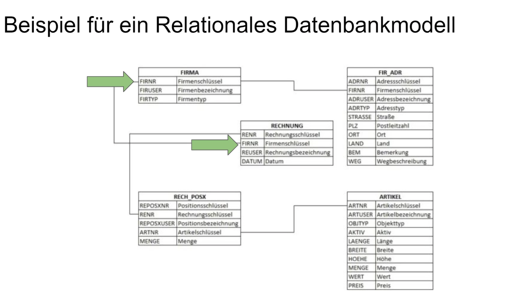
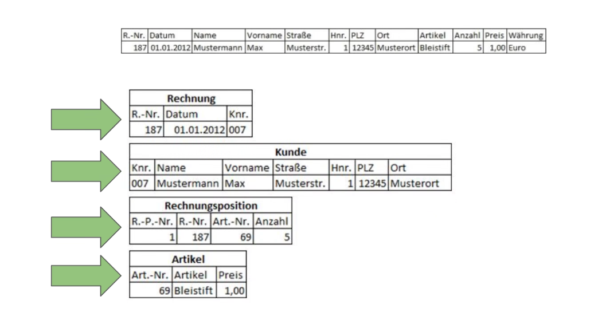
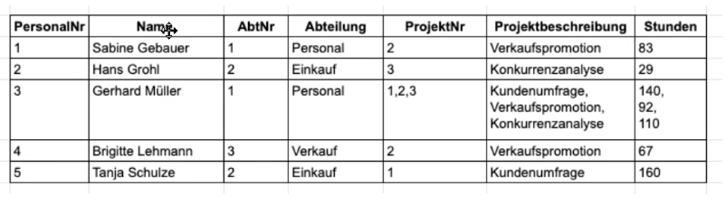
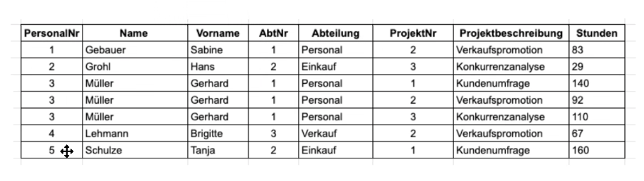
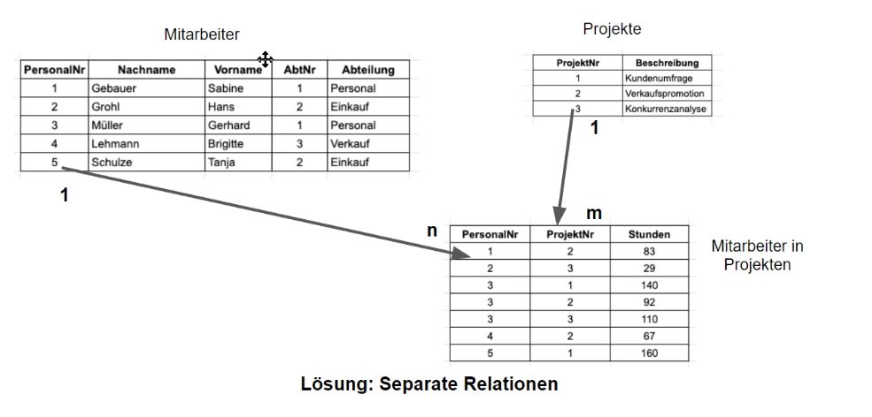
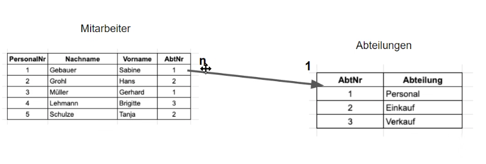
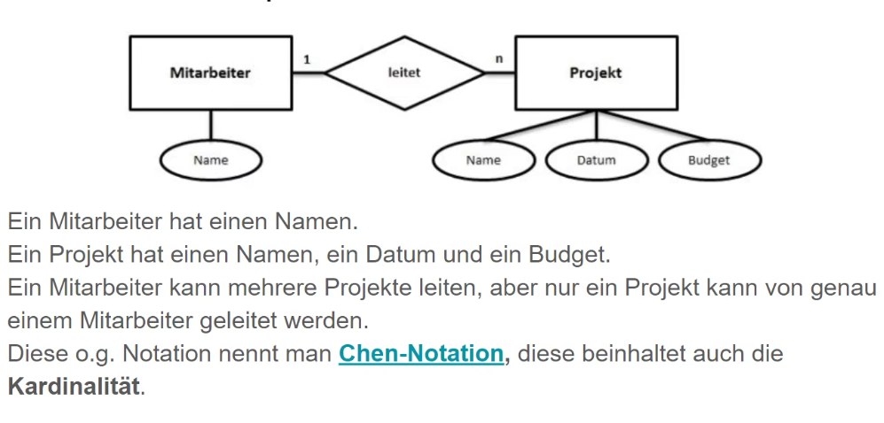
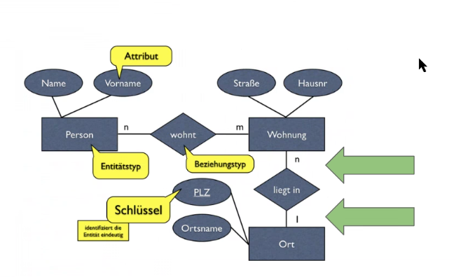

# Datenbanken


- [Datenbanken](#datenbanken)
  - [Was versteht man darunter?](#was-versteht-man-darunter)
  - [Datenbanktypen](#datenbanktypen)
  - [SQL *Strucktured  Query Language*](#sql-strucktured--query-language)
    - [Alle Datenbanken ansehen](#alle-datenbanken-ansehen)
    - [Datenbank erstellen](#datenbank-erstellen)
    - [Datenbank auswählen](#datenbank-auswählen)
    - [Zeige die Table einer Database](#zeige-die-table-einer-database)
    - [TABLE erstellen](#table-erstellen)
  - [Relationale Datenbankenmodelle *Grundlagen*](#relationale-datenbankenmodelle-grundlagen)
    - [Eigenschaften des Relationalen Datenbankmodells](#eigenschaften-des-relationalen-datenbankmodells)
    - [Normalisierung](#normalisierung)
    - [Anomalien](#anomalien)
    - [Normalisierung und Abhängigkeit](#normalisierung-und-abhängigkeit)
    - [Normalformen](#normalformen)
      - [Beispiel:](#beispiel)
    - [Enitiy-Relationship-Modell *ER*](#enitiy-relationship-modell-er)


## Was versteht man darunter? 

- Systeme zum speichern und Abrufen von Daten
- Anwendungen von Strukturen / Datenmodelle
- Persistence (Werte un der App nach dem Beenden halten)

## Datenbanktypen

- Flat Files
  - Zum Speichern con textbasierten Informationen *.md/.txt/ JSON*
  - verwendet in Flat-File_cms Kirby/Grav
- Relationale DBs (small data)
- Relationale DBs
  - MySQL/MAriaDB/PostgreSQL / ORACLE 
  - RDBMS --> "relational database managment system"
  - Tabellen, die zueinander in Beziehungen stehen *relations*
  - Umfangreiche Metadaten (Indizes, Funktionen, etc.)
- Nicht relationale DBs (NoSQL)


## SQL *Strucktured  Query Language*

> Die abkürzung SQL steht für "Structured Query Language"

> befehle müssen mit ; beendet werden


-----------

### Alle Datenbanken ansehen
>**SHOW DATABASES** 
>
>shows all databases in the MySQL server

```sql
mysql> SHOW DATABASES;

+--------------------+
| Database           |
+--------------------+
| information_schema |
| mysql              |
| performance_schema |
| sys                |
+--------------------+
```

### Datenbank erstellen
>**CREATE DATABASE {name of Database}** 
>
>creates a database in the current server

```sql
mysql> CREATE DATABASE {name of Database};

//out:
Query OK, 1 row affected (0.01 sec)

mysql> SHOW DATABASES;

+--------------------+
| Database           |
+--------------------+
| information_schema |
| {name of Database} |
| mysql              |
| performance_schema |
| sys                |
+--------------------+

```


### Datenbank auswählen
>**USE {name of Database}** 
>
>you use the selected database
>A database needs to be selected in order to show the tables

```sql
mysql> USE {name of Database};

out:

Database changed
```


### Zeige die Table einer Database
>**SHOW TABLES** 
>
>Shows the tables of the selected Database
> A database needs to be selected in order to show the tables

```sql
mysql> SHOW TABLES;

out if no tables:

Empty set (0.00 sec)


```


### TABLE erstellen
>**CREATE TABLE {name of table}** 
>
>Creates a table in the [selected](#datenbank-auswählen) database

```sql
mysql>

```


## Relationale Datenbankenmodelle *Grundlagen*

- ist das am weitesten verbreiteten Datenmodell, welches in der Datenbankentwicklung als Standard genutzt wird
- vier Elemente machen diese aus :
  - Tabellen
  - Attribute
  - relationale algebra
- Was ist eine Entität?
  - Stellt ein Objekt eines Themenkreis da Mit Objekten mit gleichen Merkmalen 
  - *zb. Firma,Student,Kurs,Dozent*
  - Entitätsmenge: *Alle Datensätze einer Entität* repräsentiert alle Datensätze, die zu einer Entiät gehören 
- **Relation(Tabelle)**
  - umfasst eine Entität inklusive der dazugehörigen Entitätsmenge.
  - eine Komplette Relation besteht aus tupeln eine Entität *Tupel -> rep. Alle Merkmalswerte einer Entiät einer Entitätsmenge*
  - Alle Tupel einer Entität bilden die Entitätsmenge
- Attribut
  - Ein Attribut beschreibt die Entität


> Entität/Tupel --> Konkreter Datensatz
> Entitätsmenge --> Alle Datensätze
> Attribute --> Spalten/Felder
> Beziehungen --> Verknüpfungen zwischen Tabellen


### Eigenschaften des Relationalen Datenbankmodells

- Jeder Datensatz besteht aus einer Tupel von eigenschaften 
- --> Spalten der Tabelle
- Realtions schema:
  - Anzahl, Typ der Attribute
  - Verknüpfungen *Beziehungen* über Primärschlüssel herstellen
  - zb --> `id INT(11) PRIMARY KEY` *Primary key wird verwendet um Tabellen miteinander zu verbinden*


**Beispiel verbundene Tabellen:**



> Dieses Beispiel braucht korrekte Normalisierung und deren Normalformen um korrekt erstellt werden zu können


### Normalisierung

> ziel ist eine Redundanzfrei Datenspeicherung --> Daten sind nur EINMAL irgendwo gespeichert

- Normalisierung soll außerdem auch Anomalien entfernen, im Normalisierungprozess gibt es fünf Noramlformen
  -  In der Datenbankentwicklung ist die *Dritte Normalform* oft ausreichend *perfekte balance aus Redundance performance*
  - *Eine redundanzenfreie datenbank ist eine Datenbank ohne doppelte Daten auskommt* 
  - jedoch kann Redundanz manchmal aus performancegründen Sinn machen
  - --> Redundanzen können mittels der *Normalisierung* entfernt werden

### Anomalien

- Einfüge
  - bei fehlerhaften design können manchmal Daten gar nicht übernommen werden, wenn zb der Primärschlüssen keinen Wert erhalten hat
- Änderung *Update*
  - Dinge werden nicht automatisch mitgeändert *Inkonsistente Werte*
- Löschen
  - Eine Datei ist gelöscht. Ist aber noch in einem anderen Part der Datenbank vorhanden

### Normalisierung und Abhängigkeit
  - Funktionale Abhängigkeit : zu jedem x genau ein y
  - Voll funktionale Abhängigkeit alle teile sind funktional abhängig
  - Transitive Abhängigkeit: y von x und z von y somit z von x *wird mit 3.Normalform erreicht* 

### Normalformen

- Nullte Normalform
  - Sammeln von unstrukturierten information --> alle Datenelemte der realen Welt ist in der Tabelle zusammengefasst
  - zb. unnormalisierte Rechnungsinfromationen *Informationen sind unnormalisiert*
- Erste Normalform (1NF)
  - alle Infromationen liegen in der Tabelle *atomar* vor
  - alle informationen haben eine eigen Tabellenspalte 
  - zb PLZ und ORT liegen nicht in der Gleichen spalte vor
  - Name / Vorname Spalten
  - *Man kann die werte nicht weiter aufteilen* --> Atomatisiert 
- Zweite Normalform (2NF)
  - PRÜFT ob eine vollständige funktionale  tabelle vorliegt oder nur *eine* abhängigkeit besteht 
  - wid oft schon passiv erreicht bei Erstellung eines ER-Diagramms
  - Logische Aufspaltung von Komplexen Sachverhalten, Geschäftsprozesse in Relation bringen
  - jedes nichtschlüsselattribut muss von jedem SchlüsselKandidaten voll Funktional abhängig sein
  - Beispiel:
    - Nachname ist nicht eindeutig daher wird jedem Kunden eine Kuden Nummer Zugeordnet 
    - 
    - > Beispiel für 2. Normalform
- Dritte Normalform(3NF)
  - Wenn es sich in 2NF befindet und kein Atrribut Transativ ist 
  - zb plz in eine Eigene Tabelle abspalten und sie under der PLZ zuordnen --> indirekte Abhängigkeit


#### Beispiel:


> Die Beispieltabelle in der 0NF keine Normalisierung *Zusammentragen der Daten*
> Hier gibt es viel redundanz zb. VerkaufsPromotion 



> Schlüsselkandidaten herausfinden, Atomatisieren, Name vorname trennen. *Elementare Daten*
>
> zb Wurde Müller aufgeteilt damit es mehr sortiert ist der punkt wurde Atomatisiert 
>
> Problem ist aber das es jetzt keinen Eindeutigen Primärschlüssel mehr gibt



> Für die umwandlung in 2NF Personal, Abteilung und Project trennen
>
> ProjektNr ist nicht abhängig vom primärschlüssel daher sollte aufgetrennt werden *seperate realtion*
> n zu m relation
>
> zb kann ein neues projekt hinzugefügt werden indem man einfach einen neuen eintrag in Projekte macht
> oder zb namensänderung


> bei 3NF könnte man die abteilung auch nochmal abspalten 

-----
### Enitiy-Relationship-Modell *ER*

> Gebildet aus : 
> - Entitäten *Individuell identifizierbares model*
>    
> - Beziehungen *Verknüpfung/zusammenhang zwischen zwei oder mehreren Entitäten*
> - Atributte *Eine Eigenschaft die im Kontext zu einer Entität steht* Ähnlich wie bei OOP
> - Kardinalität In welcher relation zwei Entitäten stehen zb 1:n oder 1:1 ein mitarbeiter kan 1:n projekte leiten kann mehre muss aber auch keines. 1:1 währe zb ein projekt mit einem Startdatum
>     - 1:1 Benutzt man nur wenn man zb eine tabelle spaltet


Beispiel:

Genaueres: [Chen-Notation](https://de.wikipedia.org/wiki/Chen-Notation)



> Beispiel einer 1:n Beziehung 


Video: [Entity Relationsjhip Modellierung](https://www.youtube.com/watch?v=F5rTvnbjPq8&ab_channel=Prof.Dr.JensDittrich%2CBigDataAnalytics)